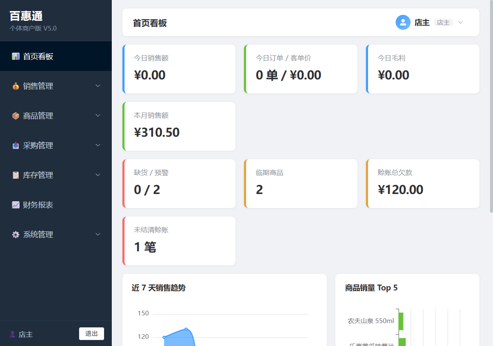
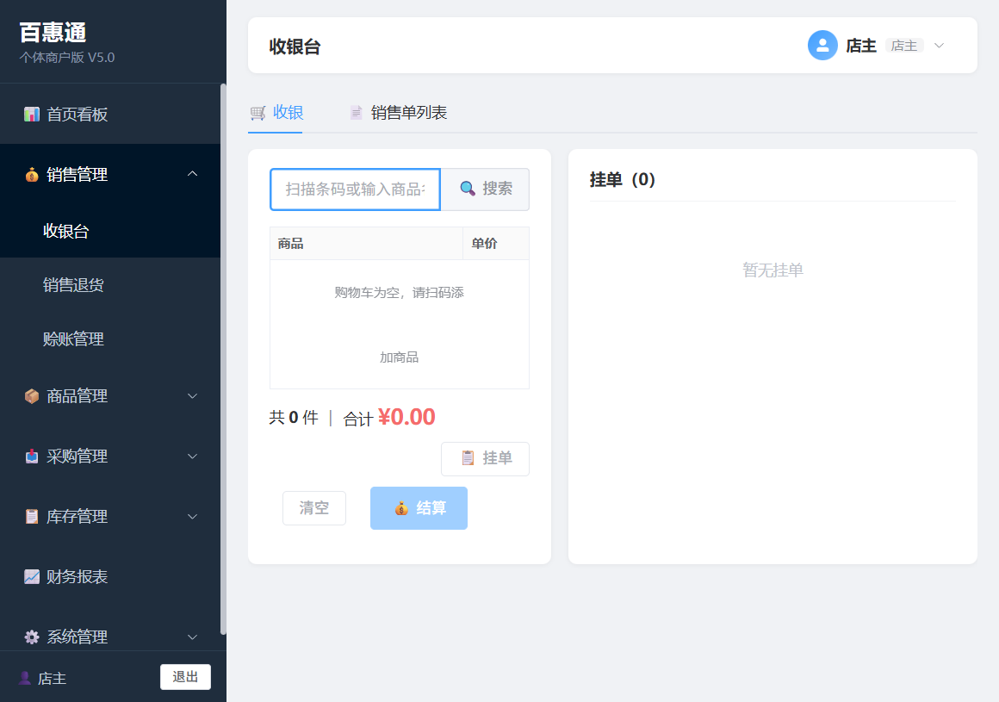
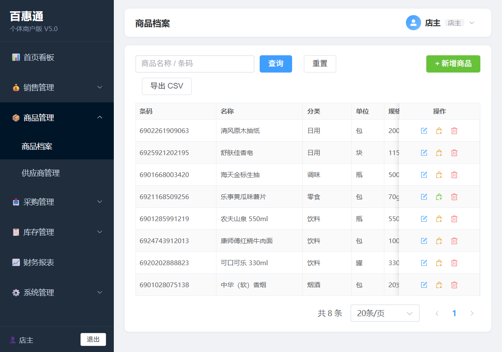
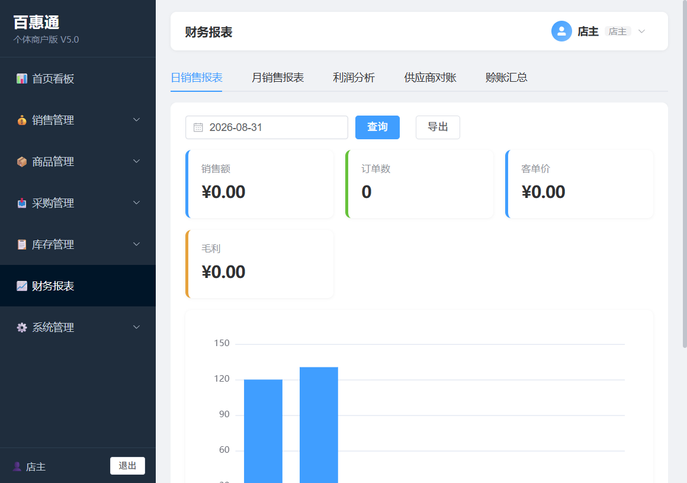

# Beneflow（百惠通）

便利店进销存管理系统。.NET 8 Web API + 原生 Vue 3 / Element Plus 前端（本地离线 lib，无 npm、无构建工具）。

## 预览

| | |
|---|---|
|  |  |
|  |  |

## 功能

- 收银开单 / 销售退货 / 赊账管理
- 采购入库 / 采购退货
- 库存盘点 / 库存预警 / 临期预警
- 商品条码：扫码录入；系统首页生成二维码，手机扫码后打开手机端入库页面（html5-qrcode，需 HTTPS 调用摄像头）
- 报表：利润分析 / 供应商对账 / 赊账汇总
- 用户 / 角色 / 菜单权限、操作日志
- JWT 认证；局域网 HTTPS（自动生成自签证书，手机端安装根 CA 后扫码即可访问移动页面）

## 快速开始

### 1. 环境要求

- [.NET 8 SDK](https://dotnet.microsoft.com/download/dotnet/8.0)
- SQL Server 2019+（Express 即可）
- EF 迁移工具（已装可跳过）：

```powershell
dotnet tool install --global dotnet-ef
```

### 2. 配置

复制配置模板并填入真实值（`appsettings.json` 含密钥，已被 .gitignore 排除）：

```powershell
copy src\Beneflow.Api\appsettings.example.json src\Beneflow.Api\appsettings.json
```

需要修改的项：

| 配置 | 说明 |
|---|---|
| `ConnectionStrings:Default` | SQL Server 连接串（账号、密码、库名） |
| `Jwt:Secret` | 随机字符串，至少 32 字节 |
| `Security:AesKey` | base64 的 32 字节随机密钥（用于敏感字段加密） |

### 3. 建库

```powershell
dotnet ef database update --project src\Beneflow.Api
```

### 4. 运行

```powershell
dotnet run --project src\Beneflow.Api
```

- 首次启动自动种子演示数据（商品、供应商、单据、系统配置）
- TLS 证书自动生成于 `%LocalAppData%\Beneflow\tls`，手机端安装根 CA 证书后 HTTPS 受信
- 数据库备份输出到 `backups/`（不入库）

## 演示账号

| 用户名 | 密码 | 角色 |
|---|---|---|
| admin | 123456 | 店主（全部菜单） |
| cashier | 123456 | 收银员（收银/退货/赊账/库存） |
| buyer | 123456 | 采购员（商品/供应商/采购/库存） |

## 目录结构

```
src/Beneflow.Api/
├── Controllers/        # API 控制器（一文件一控制器，统一继承 BaseApiController）
├── Services/           # 业务服务（按域分目录：Users/Product/Sale/...，接口 + 实现）
├── Models/             # 实体（Entities/）、DTO、统一响应 ApiResult
├── Data/               # AppDbContext、DbSeeder 种子数据
├── Migrations/         # EF Core 迁移
├── Utils/              # PasswordHasher、AesStringCipher、NetUtil
└── wwwroot/            # 前端静态页（Vue 3 + Element Plus，动态加载 pages/*.html）
    └── lib/            # 离线第三方库（随仓库提交，无需下载）
```

## 安全提示

- 任何密钥（数据库密码、JWT Secret、AesKey）不要提交到仓库
- 生产部署务必修改演示账号密码，并更换 `appsettings.example.json` 中的占位密钥
